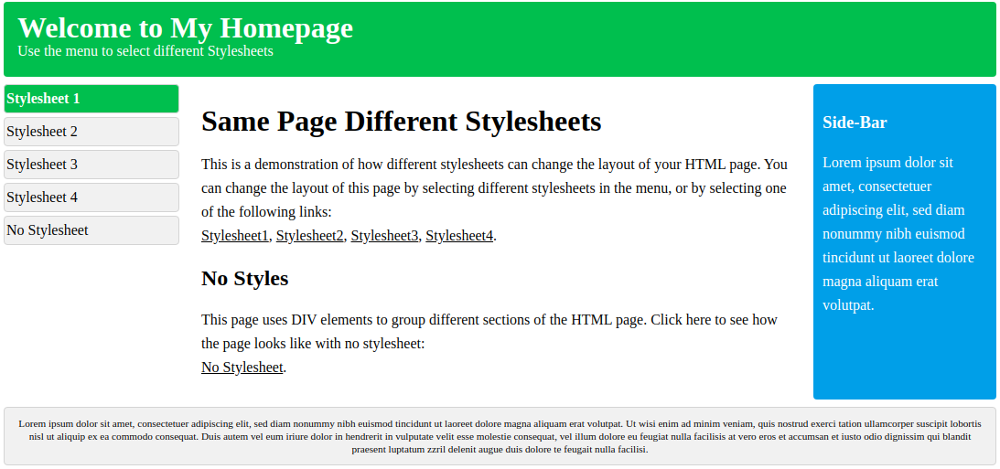

## HTML5
HTML = Hypertexte Markup Language. Langage de balise 
A été inventé au moment du WWW en 1990 (avec notamment le protocol HHTP)

Qu'est ce que le HTML5 a amené de plus ? : https://www.ideematic.com/actualites/2012/03/presentation-de-lhtml-5/

### Syntaxe
```html
<balise> Contenu </balise>
```
```html
<!DOCTYPE html> <!--  Représente le type document,et aide le navigateur à afficher la page correctement -->
<html>
    <head>
        <title>Page Title</title>
    </head>
    <body>

        <h1>This is a Heading</h1>
        <p>This is a paragraph.</p>

    </body>
</html>
```
#### Tags 
#https://www.w3schools.com/tags/  
```html
<h1>This is heading 1</h1>
<p>This is a paragraph</p>
<a href="url.com">This is heading 3</a> https://www.w3schools.com/html/html_attributes.asp https://www.w3schools.com/tags/ref_attributes.asp
```
#### ID et Class
```html
<h1 class="titre">This is heading 1</h1>
<h1 id="premier-titre">This is heading 1</h1>
<h1 class="titre" id="premier-titre">This is heading 1</h1>
```

## CSS3
CSS = Cascading Style Sheets. 
Language qui permet de mettre en forme une page web en décrivant comment les éléments HTMLs doivent être affichés.
Un style CSS peut influencer plusieurs pages d'un site en même temps.
https://www.w3schools.com/cssref/



### Syntaxe
```css
Selector {
    property : value;
}

h1 {
  color: white;
  text-align: center;
}
```
#### ID Selector
```html
<p id="unique">Lorem ipsum dolor sit amet</p>
```
```css
#unique {
    property : value;
}
```
#### Class Selector
```html
<p class="main">Lorem ipsum dolor sit amet</p>
```
```css
.main {
    property : value;
}
```
#### Regroupement de selector
Si nous avons besoin d'appliquer à plusieurs id / classes / balises le même style :
```css
h1, #id, .class {
  text-align: center;
  color: red;
}
```
#### Inline CSS
Appliquer un style directement dans la balise CSS
```html
<p style="color:red;">This is a paragraph.</p>
```
